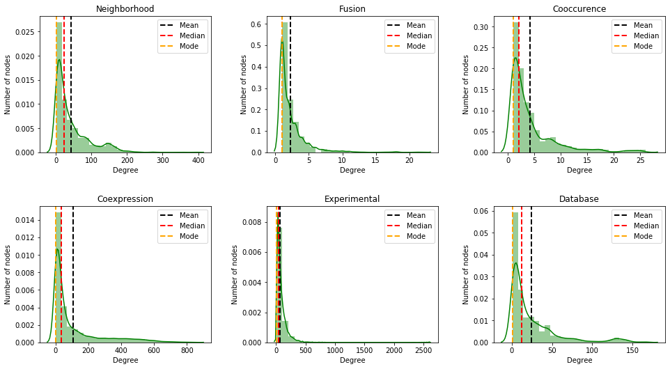

+++
title = "Key properties of Biological Networks"
subtitle = ""

# Add a summary to display on homepage (optional).
summary = ""

date = 2020-03-16T15:12:52-04:00
draft = false

# Authors. Comma separated list, e.g. `["Bob Smith", "David Jones"]`.
authors = ["Kishan K C"]

# Tags and categories
# For example, use `tags = []` for no tags, or the form `tags = ["A Tag", "Another Tag"]` for one or more tags.
tags = ["Network", "Graph", "Data Science"]
categories = ["Network"]

# Projects (optional).
#   Associate this post with one or more of your projects.
#   Simply enter your project's folder or file name without extension.
#   E.g. `projects = ["deep-learning"]` references 
#   `content/project/deep-learning/index.md`.
#   Otherwise, set `projects = []`.
# projects = ["internal-project"]

# Featured image
# To use, add an image named `featured.jpg/png` to your page's folder. 
[image]
  # Caption (optional)
  caption = ""

  # Focal point (optional)
  # Options: Smart, Center, TopLeft, Top, TopRight, Left, Right, BottomLeft, Bottom, BottomRight
  focal_point = ""
+++


# Networks

Networks are a general language for describing complex systems of interacting entities. It also provides a shared vocabulary between fields: Computer Science, Social Science, Biology, Physics etc.

## Biological Networks

A biological system is a complex network of various molecular entities such as genes, proteins and other biological molecules linked together by the interactions between these components. 
The study of the interactions between these molecular entities not only plays a crucial role in understanding biological phenomena but also provides insights about the molecular etiology of diseases as well as the discovery of putative drug targets.


Figure is taken from Network medicine in the age of biomedical big data, Frontiers inGenetics.

Above figure illustrates that the biological system is the complex interplay of various entitites at various levels. 

In this blog, we will explore the key properties of protein-protein interaction (PPI) networks. PPI networks describes the interactions between proteins (with or without the strength of interactions). Formally, PPI network is the network with proteins as the node and their interactions as the edges. Interaction strength is added as the edge weights of the network. The network is **weighted** and **undirected**.

### Datasets

PPI network's data is extracted from [STRING](https://string-db.org) database. There are different types of networks available for different organisms. The type of networks are:
- **Conserved Neighborhood**: The neighborhood view shows runs of genes that occur repeatedly in close neighborhood in (prokaryotic) genomes.
- **Cooccurence**: The occurrence view shows the presence or absence of linked proteins across species.
- **Fusion**: The fusion view shows the individual gene fusion events per species. 
- **Co-expression**: The coexpression view shows the genes that are co-expressed in the same or in other species (transferred by homology).
- **Experiments**: The experiments view shows a list of significant protein interaction datasets, gathered from other protein-protein interaction databases.
- **Databases**: This view shows a list of significant protein interaction groups, gathered from curated databases. 
- **Text mining**: The text mining view shows a list of significant protein interaction groups, extracted from the abstracts of scientific literature. 

More details about the type of networks can be found in [STRING Evidence](https://string-db.org/cgi/help.pl?sessionId=QQiF95b0Nkj3). For simplicity, you can consider these networks as a graph with same nodes but with multiple edges if they exist in different evidence types.

### Import python libraries

- **Networkx**: to study the structure, dynamics and functions of complex networks
- **Numpy**: to process arrays
- **Matplotlib**: plotting library to create various plots
- **prettytable**: Create table to display outputs


```python
import networkx as nx
import numpy as np
import matplotlib.pyplot as plt
import seaborn as sns
from prettytable import PrettyTable
from collections import Counter
from scipy import stats
```


```python
data_folder = "data/yeast/networks/"
network_types = ['neighborhood', 'fusion', 'cooccurence',
                   'coexpression', 'experimental', 'database']
```

##### Loading edgelists to networkx graphs


```python
nx_graphs = {}
for net in network_types:
    print("Loading", net)
    filename = data_folder + 'yeast_string_' + net + '_adjacency.txt'
    G = nx.read_edgelist(filename, edgetype=float, data=(('weight', float),))
    nx_graphs[net] = G
```

    Loading neighborhood
    Loading fusion
    Loading cooccurence
    Loading coexpression
    Loading experimental
    Loading database


Since the networks are based on different evidences, we expect to see varying interactions for different types of networks.


```python
table = PrettyTable()
table.field_names = ['Network type', 'Number of proteins', "Number of interactions", "Averge degree <k>"]
for net in network_types:
    num_nodes = nx_graphs[net].order()
    num_edges = nx_graphs[net].size()
    table.add_row([net, num_nodes, num_edges, round(float(num_edges)/ num_nodes, 2) ])

print(table)
```

    +--------------+--------------------+------------------------+-------------------+
    | Network type | Number of proteins | Number of interactions | Averge degree <k> |
    +--------------+--------------------+------------------------+-------------------+
    | neighborhood |        2172        |         91220          |       41.99       |
    |    fusion    |        1191        |          2722          |        2.29       |
    | cooccurence  |        1271        |          5328          |        4.19       |
    | coexpression |        5811        |         628026         |      108.07       |
    | experimental |        6169        |         439990         |       71.32       |
    |   database   |        2712        |         66972          |       24.69       |
    +--------------+--------------------+------------------------+-------------------+


Above table shows that the number of proteins involved in interactions are different in different networks.

# Degree distribution of the network

Degree distribution $P(k)$: Probability that a randomly chosen node has degree k.


```python
plt.figure(figsize=(14, 8))
for i, net in enumerate(network_types):
    plt.subplot(2, 3, i+1)
    degrees = [degree for node, degree in nx_graphs[net].degree()]
    sns.distplot(degrees, color='g', bins= 25)
    plt.axvline(x=np.mean(degrees), linestyle="--", linewidth=2, color="k", label="Mean")
    plt.axvline(x=np.median(degrees), linestyle="--", linewidth=2, color="r", label="Median")
    plt.axvline(x=stats.mode(degrees)[0], linestyle="--", linewidth=2, color="orange", label="Mode")
    plt.xlabel('Degree')
    plt.ylabel('Number of nodes') 
    plt.legend()
    plt.title(net.capitalize())
plt.tight_layout(pad=3.0)
```





From the histogram plot, we see that the plot shows right skewed distribution, which is also known as positive skewness. The mean, median and mode are different. Moreover, the mean is greater than the median and mode. The reason for this is the long tail (lot of values) on the right that skews the mean but does not skew median since median is just the number in the middle.

We further explore the key properties of the network:
- **Clustering coefficient of the nodes**: Proportion of neighbors of a node which are connected by an edge. According to Wikipedia, a clustering coefficient is a measure of the degree to which nodes in a graph tend to cluster together.
- **Connected components(CC)**: A set of nodes whre any two nodes can be joined by a path


```python
table = PrettyTable()
table.field_names = ['Network type', "Number of nodes", "Avg. clustering coef.", "Num. of CC", "%node in LCC"]
for net in network_types:
    G = nx_graphs[net]
    clus_coeff = nx.average_clustering(G)
    
    connected_components = nx.connected_components(G)
    largest_cc = len(max(connected_components, key=len))
    
    connected_components = nx.connected_components(G)
    num_components = len(list(map(len, list(connected_components))))
    
    table.add_row([net, G.order(), clus_coeff, num_components, round(float(largest_cc)/G.order(), 2)])

print(table)
```

From above table, we can infer that almost all the proteins in **neighborhood**, **coexpression**, **experimental** and **database** networks are connected (indicated by size of largest connected component). Other two networks: **fusion** and **cooccurence** have disconnected components. 

We will analyze these network further with different algorithms for different tasks.
